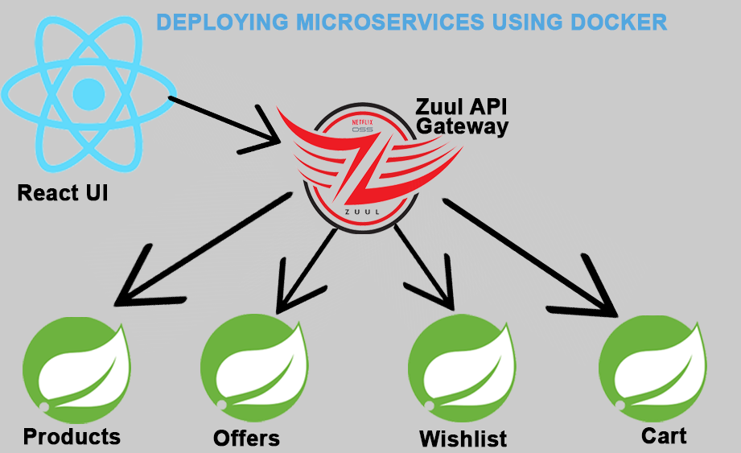

# Microservices

This Demonstration is about Deploying Micro-services Using Docker

In this demo, I deployed six different microservices made up of a react application, Zuul api gateway for load balancingand route traffic to the appropriate service, product service, offers service, cart service and whishlist servicess.

It is made up of three sections.
Section I: Create Services and Dockerfiles
Section II: Build images and deploy the services
Section III: Deploy the microservices using Docker Compose and Docker swarm

Please click on the link to view the full summary of the demonstration http://www.docker-microservice.cloud2day.link/